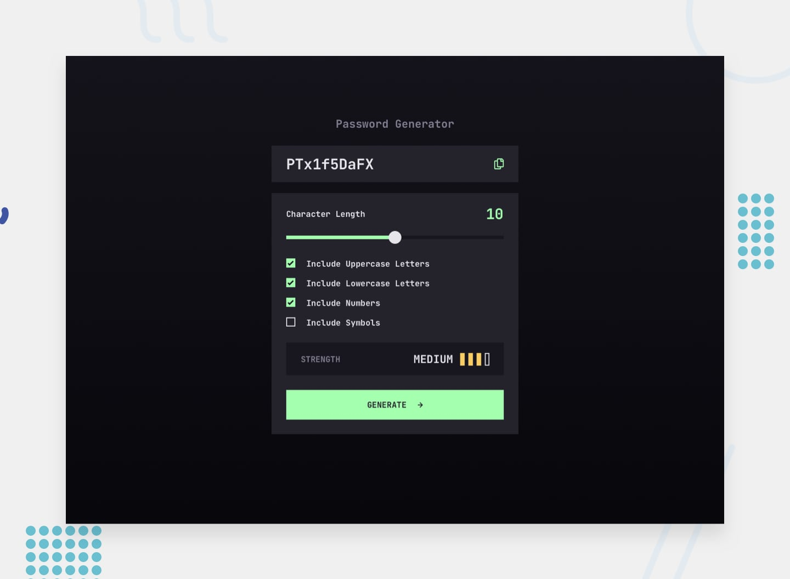

# Frontend Mentor - Password generator app solution

## Welcome! 👋

This is a solution to the [Password generator app challenge on Frontend Mentor](https://www.frontendmentor.io/challenges/password-generator-app-Mr8CLycqjh). Frontend Mentor challenges help you improve your coding skills by building realistic projects.

## Table of contents

- [Overview](#overview)
  - [The challenge](#the-challenge)
  - [Screenshots](#screenshots)
  - [Links](#links)
  - [My process](#my-process)
  - [What I learned](#what-i-learned)
  - [Continued development](#continued-development)
  - [Useful resources](#useful-resources)
  - [Author](#author)
  - [Acknowledgments](#acknowledgments)

## Overview

### The challenge

Users should be able to:

- Generate a password based on the selected inclusion options
- Copy the generated password to the computer's clipboard
- See a strength rating for their generated password
- View the optimal layout for the interface depending on their device's screen size
- See hover and focus states for all interactive elements on the page

### Screenshots

.png?raw=true)

### Links

- Frontend Mentor solution url: https://www.frontendmentor.io/solutions/responsive-password-generator-app-nqA1vFeoNc   
- Live Site URL: https://atif-dev.github.io/FEM_password-generator-app/

### My process

  - Built a responsive page closely match to design.
  - Developed in terms of code readability.
  - Added keyboard accessibility.
  - Coded JS as defensive programming.
  - Project includes concept of Separation of Concerns.
  - My efforts + Google + chatGPT.

### What I learned

  - Styling input type range.
  - Copy to clip board.
  - Regular expressions.
  - The five factors: length, character pool size, randomness, structural predictability and known-pattern detection
    are involved in strength of a password.(This intermediate project does not include high level implementation of these factors)

### Continued development

  - Will learn more about accessibility.

### Useful resources

- [Style Input Type Range](https://brennaobrien.com/blog/2014/05/style-input-type-range-in-every-browser.html)
- [Generate a Random Number](https://css-tricks.com/generate-a-random-number/)
- [Generate random alpha-numeric string](https://www.geeksforgeeks.org/javascript/generate-random-alpha-numeric-string-in-javascript/)
- [Regular expressions](https://developer.mozilla.org/en-US/docs/Web/JavaScript/Guide/Regular_expressions)
- [JavaScript RegExp](https://www.w3schools.com/js/js_regexp.asp)
- [Sets and ranges](https://javascript.info/regexp-character-sets-and-ranges)

## Author

- [atif-dev @ Frontendmentor](https://www.frontendmentor.io/profile/atif-dev)

## Acknowledgments

Completed this project using my existing knowledge plus with the help of Google and chatGPT. Process of building also includes explore and find things, understand how code works, logic build and refine in terms of different quality factors.
 
**✨Built in a right way and learn in a right way✨** 
